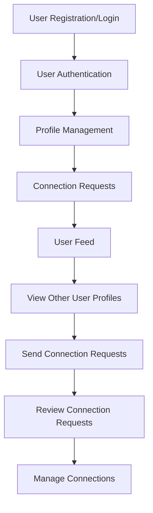

# 🛠️ CodeBuddy Backend

CodeBuddy Backend is the server-side component of the CodeBuddy project, a platform designed to connect developers based on shared skills, interests, and profiles. This backend service handles user authentication, profile management, connection requests, and more.

---

## 📊 Features

### User Authentication:
- Secure user registration, login, and logout using JWT.

### Profile Management:
- Create, view, and edit user profiles.

### Connection Requests:
- Send, review, and manage connection requests between users.

### User Feed:
- Display profiles of other users on the platform.

---

## ⚙️ Tech Stack

- **Backend**: Node.js, Express
- **Database**: MongoDB
- **Authentication**: JWT

---

## 🔧 Installation

Follow these steps to set up and run the backend locally:

### Prerequisites

- **Node.js**
- **MongoDB**
- **npm** (Node Package Manager)

### Clone the Repository

```bash
git clone https://github.com/Sandipkushwaha20/CodeBuddy.git
cd CodeBuddy/backend
npm install
```

### Start the Server

```bash
npm run dev
```

---

## 📊 API Endpoints

### Auth Routes
- **POST** `/signup`: Register a new user.
- **POST** `/login`: Login an existing user.
- **POST** `/logout`: Logout the current user.

### Profile Routes
- **GET** `/profile/view`: View the current user's profile.
- **PATCH** `/profile/edit`: Edit the current user's profile.
- **PATCH** `/profile/password`: Change the current user's password.

### Connection Request Routes
- **POST** `/request/send/:status/:userId`: Send a connection request to a user. `status` can be `interested` or `ignored`.
- **POST** `/request/review/:status/:requestId`: Review a connection request. `status` can be `accepted` or `rejected`.

### User Routes
- **GET** `/user/requests`: Get the current user's connection requests.
- **GET** `/user/connections`: Get the current user's connections.
- **GET** `/user/feed`: Get profiles of other users on the platform.

---

## 📁 Project Structure

```plaintext
CodeBuddy/
├── .gitignore
├── package.json
├── README.md
├── src/
│   ├── app.js
│   ├── config/
│   │   └── database.js
│   ├── middlewares/
│   │   └── auth.js
│   ├── models/
│   │   ├── connectionRequest.js
│   │   └── user.js
│   ├── routes/
│   │   ├── auth.js
│   │   ├── profile.js
│   │   ├── request.js
│   │   └── user.js
│   └── utils/
│       └── validation.js
```

---

## 🔄 Workflow Diagram



---

## 🚀 Example Usage

1. **Run the Server**:
   - Start the backend server using `npm run dev`.

2. **Test the API**:
   - Use tools like Postman to test endpoints such as `/signup` and `/login`.

3. **Integration**:
   - Connect this backend with the frontend or any client for a full-stack application.

---

## 🔧 Future Improvements

- Add email notifications for connection requests.
- Implement real-time messaging between users.
- Add pagination and filtering options to the user feed.

---

## 📢 Credits

- Developed by: Sandip Kushwaha

---

## 📚 License

This project is licensed under the MIT License.
